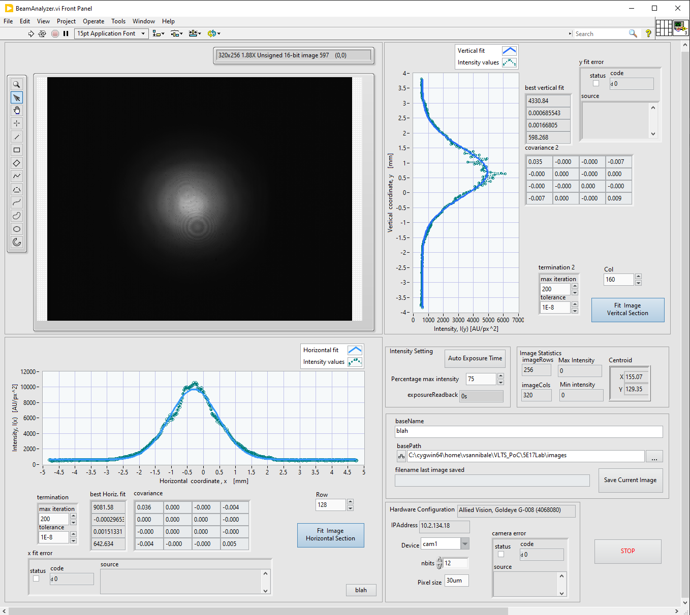
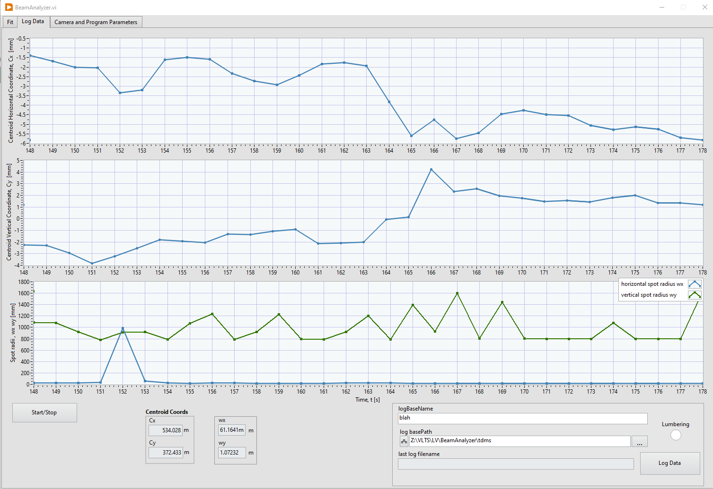
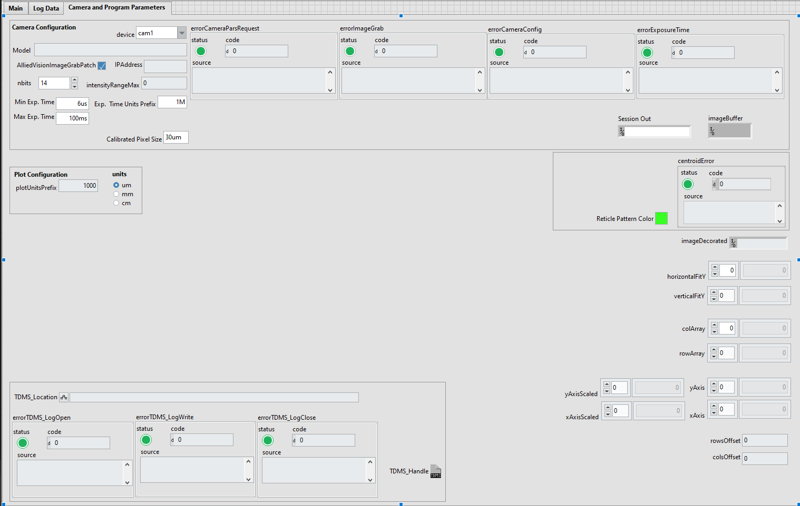

# Beam Analyzer

### Laser Beam Propagation Analyzer

LabVIEW program for the charaterization of laser beam intensity and propagation profile

# UI Main Tab

# UI Log Data Tab

# UI Camera and Program Parameters Tab

### TODO
* Fix autoexposure routine
* keep debugging
